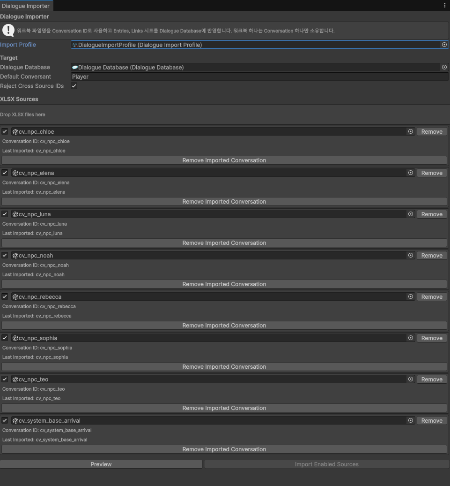

# 질문이 실제 구현에 반영됐는가?

검증일: 2026-10-08 (한국 시간 기준)

검증 기준 코드: Project-BFX `1a7d803330923ee6f9f40f5e4bda9e84fb7fab7b`.

이 문서는 **사용자 질문 → 대화에서 정한 방향 → 실제 Git 변경 → 현재 구현**을 연결합니다. 질문 이미지만으로 해결을 주장하지 않고, 코드 반영과 런타임 검증을 구분합니다. 이번 작업에서 게임을 다시 실행하거나 회귀 테스트를 수행하지 않았습니다.

## 근거를 읽는 방법

- **변경 반영 확인:** 질문과 부합하는 후속 커밋의 실제 diff를 확인했습니다. 시각적 결과가 정상이라는 보장이나 사용자의 질문이 유일한 원인이었다는 주장은 아닙니다.
- **현재 구조 확인:** 기준 커밋의 소스에서 해당 설계 원칙이 어떻게 구현돼 있는지 확인했습니다.
- **근거 제한:** 대화에서 제안한 내용은 확인되지만 삭제 이력 또는 버그 수정·재검증까지 연결되지 않은 경우입니다.

질문 전체 원문과 식별자는 [evidence/sources.json](evidence/sources.json)에, 코드·diff 이미지와 원문 발췌는 [code-evidence/README.md](code-evidence/README.md)에 있습니다. 첨부된 임포터 화면은 [사용자가 직접 촬영한 원본](media/dialogue-importer-user-capture.png)입니다.

## 이미지 빠른 연결

| 사례 | 질문 | 실제 변경 | 현재 코드·결과 |
| --- | --- | --- | --- |
| Sequence 구조 단순화 | [원문](evidence/01-story-structure.png) | [클래스 삭제](code-evidence/01_sequence_deleted_files.png), [저장 책임 제거](code-evidence/02_save_data_sequence_removal.png) | 기준 HEAD에서 해당 클래스 부재 확인 |
| Conversation별 작업 단위 | [원문](evidence/02-content-workbook.png) | [임포터 diff](code-evidence/03_dialogue_importer_workbook_transition.png) | [파일명 파싱](code-evidence/04_current_parse_conversation.png), [실제 도구 화면](media/dialogue-importer-user-capture.png) |
| 초기화 책임 분리 | [원문](evidence/04-initialization.png) | [최초 반영](code-evidence/05_npc_world_ui_initialization_added.png), [후속 변경](code-evidence/06_initialization_broadcast_transition.png) | [현재 완료 신호·가드](code-evidence/07_current_npc_world_ui_guard.png) |
| Radio 공통 호출 | [원문](evidence/07-notification-api.png) | [API 추가](code-evidence/08_publish_radio_added.png) | 현재 NotificationService.Radio에 유지 |
| 검증 도구 통합 | [원문](evidence/08-runtime-testing.png) | [통합 패널 추가·기존 도구 삭제](code-evidence/09_debug_panel_consolidation.png) | 현재 통합 패널에 종류별 호출 유지 |

코드·diff PNG는 Git/소스 원문을 읽기 좋게 렌더링한 자료이며 실제 IDE 캡처가 아닙니다. 발췌 diff는 설명용으로 생략 표시를 포함하므로 적용 가능한 패치로 사용하지 않습니다.

## 1. Sequence 계층의 필요성 재검토 → 실행·저장 구조 제거

**질문:** 2026-08-02 23:10:39, `quest2`.

> 개념적인 단위로 Squence를 쓰고 있지만, 이게 코드적으로 제어하려고 하니까 오히려 더 어색한거 같아.

원문 일부. 사용자는 같은 메시지에서 Quest·Dialogue와 지역 Trigger 중심의 구성을 대안으로 제시했습니다. [질문 이미지](evidence/01-story-structure.png)

**대화에서의 방향:** AI는 SequenceManager와 Beat Runner를 강제로 런타임 구조로 만들 필요가 없다는 의견에 동의하고, 기획상 분류와 실행 책임을 분리하는 방향을 설명했습니다.

**변경:** 같은 날 23:45:22의 [a0f812e36 — Sequence 구조 삭제](https://github.com/redforce01/Project-BFX/commit/a0f812e364b4315a25f2f5a1b255c4ffa54cff42).

- `SequenceManager.cs`, `SequenceDialogueBridge.cs` 삭제
- `SaveDataManager`의 Sequence 로드·저장 호출과 `LoadSequenceData()` 삭제
- `UserDataModel`·DTO에서 Sequence 데이터 관련 내용 제거
- `StandaloneInitializer`의 `ApplySequenceData()`와 자동 Sequence 시작 호출 제거

**현재:** 기준 HEAD의 추적 파일에서 두 클래스가 존재하지 않습니다. 단순한 명칭 변경이 아니라 실행·저장·초기화에 걸친 별도 계층을 제거한 변경입니다. 이후 모든 연출 경로가 검증됐다는 의미는 아닙니다.

**포트폴리오 문장:**

> 실제 스토리 시나리오를 대입해 Quest와 Sequence의 책임 중복을 지적하고, 별도 Sequence 실행·저장 계층을 제거하는 방향으로 구조를 단순화했다.

**주의:** 모든 연출의 재접속·재생 여부를 Quest만으로 처리한다고 일반화하지 않습니다. `01f27c8f0`의 제목은 'Sequence 통합'이지만 실제 변경은 워크북과 Dialogue Database입니다. 이를 SequenceManager 재도입으로 해석하지 않습니다.

## 2. Conversation별 작업 단위 제안 → 워크북과 임포터 규칙 변경

**질문:** 2026-08-11 23:47:07, `quest2`.

> 그럼 cv마다 다른 워크북을 두고, 시트를 Entries랑 Links로 두는건 어떻게 생각해?

원문 일부. [질문 이미지](evidence/02-content-workbook.png)

**대화에서의 방향:** Conversation 하나를 운영 단위로 두고, 파일명을 Conversation ID로 사용하며 Entries와 Links를 읽는 구성을 논의했습니다.

**변경:** 2026-08-12 00:41:38의 [11aadafdd — 데이터 시트 방식 및 툴 수정](https://github.com/redforce01/Project-BFX/commit/11aadafdd806b51b798b8c9e5cfb7dac48b0b859).

- 기존 `CH_001_SQ_*.xlsx`, `SQ001.xlsx`에서 `cv_npc_*.xlsx` 파일들로 변경
- `DialogueImporter`의 `Conversations` 시트 상수와 파싱 의존 제거
- 연결 시트를 `EntryLinks`에서 `Links`로 변경
- `ParseConversations(tables, ...)` 대신 `ParseConversation(assetPath, ...)` 호출
- `Path.GetFileNameWithoutExtension(assetPath)`에서 Conversation ID를 가져오도록 수정
- 임포트 프로파일·에디터 도구·Dialogue Database도 함께 변경

**현재:** `Assets/01_PROJECT BFX/Scripts/Editor/Dialogue/DialogueImporter.cs`의 `ParseConversation`(241행), `ParseEntries`(257행), `ParseLinks`(312행)에 이 입력 규칙이 남아 있습니다.

**사용자가 제공한 결과 화면:**

화면 상단은 워크북 하나가 Conversation 하나를 소유하고 파일명을 ID로 사용한다고 설명합니다. 소스 목록에서도 NPC별 파일, Conversation ID와 Last Imported 표시를 확인할 수 있습니다. 이 화면은 최종 도구 구성을 보여주지만, 모든 파일의 재임포트 성공이나 협업 시간 단축을 측정한 결과는 아닙니다.

**포트폴리오 문장:**

> 콘텐츠 수정 단위를 Conversation으로 재정의하고, 워크북 분리와 파일명 기반 ID 파싱을 임포터에 반영해 수정 대상과 변경 범위를 명확히 했다.

**주의:** 예전 AI 답변의 '파일 충돌이 거의 없음'은 검증된 성과가 아닙니다. 현재 `ApplySource`는 이전 Conversation을 ID로 갱신하며, 삭제는 `RemoveImportedConversations`로 분리돼 있습니다. '파일을 삭제하면 자동으로 대화가 삭제된다'고도 쓰지 않습니다.

## 3. QuestManager의 UI 초기화 책임에 반대 → 후순위 호출과 완료 이벤트

**질문:** 2026-08-12 18:15:21, `quest2`.

> Start대신에 초기화 구문을 별도로 만드는 제안은 OK. 하지만 QuestManager에 종속되는건 반대야.

원문 일부. 사용자는 같은 메시지에서 데이터 초기화 뒤 `StandaloneInitializer`가 호출하도록 제안했습니다. [질문 이미지](evidence/04-initialization.png)

**대화에서의 방향:** Presenter는 호출되면 상태를 읽어 UI를 초기화하고, Initializer는 데이터 준비 순서를 알고 호출하며, QuestManager는 UI 생명주기를 소유하지 않도록 역할을 정리했습니다.

**당시 반영:** 같은 날 18:54:36의 [f1ac58fe3 — Quest Marker 추가](https://github.com/redforce01/Project-BFX/commit/f1ac58fe39438570e90c036ddee3572ab8959785).

`StandaloneInitializer.Initialize()`의 데이터 적용·캐릭터 생성 뒤에 `InitializeNpcWorldUI()`를 추가했습니다. 이 메서드는 씬의 Presenter를 찾아 `Initialize()`를 호출합니다. 사용자 제안과 직접 대응하는 호출 위치와 메서드가 diff에 있습니다.

**이후 발전:** 2026-08-25의 [c4b293add — 초기화 완료 브로드캐스팅](https://github.com/redforce01/Project-BFX/commit/c4b293add0f31cbfbb7043dbf427324791353a5c).

- Initializer의 직접 순회 호출을 `GameInitialization.MarkCompleted()`로 교체
- Presenter는 `GameInitialization.Completed`를 구독
- `TryInitialize()`는 이미 초기화됐거나 `IsCompleted`가 false이면 종료

**현재 코드 위치:**

- `Scripts/Game/For_Develop/StandaloneInitializer.cs:94` — 준비 완료 통지
- `Scripts/Common/GameInitialization.cs:18` — 완료 상태와 이벤트
- `Scripts/Game/Dialogue/NpcWorldUIPresenter.cs:20` — 구독
- `Scripts/Game/Dialogue/NpcWorldUIPresenter.cs:49` — 준비 상태 가드

위 경로는 모두 `Assets/01_PROJECT BFX/` 아래입니다.

**포트폴리오 문장:**

> 데이터 준비 순서 문제를 해결하면서 QuestManager가 UI 초기화까지 소유하는 구조에 반대했다. 데이터 준비 후 호출하는 구조를 먼저 반영했고, 이후에는 공통 초기화 완료 신호를 통해 같은 책임 분리 원칙을 유지했다.

**주의:** '현재도 Start가 없다' 또는 '현재도 Initializer가 Presenter를 직접 순회한다'는 설명은 틀립니다. 현재 Start는 존재하지만 준비 상태를 확인한 뒤에만 실제 초기화를 진행합니다. 후속 이벤트 구조를 최초 질문에서 이미 제안한 것처럼 서술하지 않습니다.

## 4. Radio의 호출 창구 통합 → NotificationService API 추가

**질문과 결정:** 2026-08-05 01:08:25에 편입하지 않은 이유를 질문했고, 01:18:07에 편입을 요청했습니다. [질문 이미지](evidence/07-notification-api.png)

**변경:** 01:33:35의 [bbad0e459 — 무전 구현](https://github.com/redforce01/Project-BFX/commit/bbad0e459e1c767fd44e06183aa466ea85c70f08)에서 `NotificationService.PublishRadio(...)`, `Publish(RadioMessageRequest)`, 무전 취소 연결이 추가됐습니다.

**현재:** `NotificationService.Radio.cs:9`에 `PublishRadio()`가 있고 요청 객체를 공통 Publish 경로로 전달합니다. 파일은 `Scripts/Game/UI/Panel/Notification/Core/` 아래입니다.

**주장 가능한 결과:** 질문 후 공통 호출 API가 실제로 추가됐습니다. 무전 시스템 전체를 이 질문 하나로 설계했다고 과장하지 않습니다.

## 5. 재현 도구 통합 요청 → 개별 도구 삭제와 통합 패널 추가

**요청:** 2026-08-05 01:34:50에 무전 입력·전송 도구를 요청하고, 02:41:37에 MessageFeed·Banner·Radio·Modal의 통합을 요청했습니다. [질문 이미지](evidence/08-runtime-testing.png)

**변경:** 03:00:44의 [7858d52ae — Modal 및 TestDebugPanel 통합](https://github.com/redforce01/Project-BFX/commit/7858d52ae9d60f2f21d13a4d3f985bb8fbe157d4).

- `NotificationRuntimeDebugPanel.cs` 추가
- 개별 `MessageFeedInputTest.cs`, `RadioRuntimeTestTool.cs` 제거
- 종류별 입력·전송과 Modal 확인/취소 호출 제공

**현재:** `NotificationRuntimeDebugPanel.cs:73`의 `DrawWindow`가 여러 알림 영역을 그립니다. 122행의 Radio 영역은 사용자가 입력한 대사를 `NotificationService.PublishRadio()`로 전송합니다.

**주장 가능한 결과:** 게임 상황을 매번 구성하지 않고 알림을 직접 호출할 수 있는 수동 검증 경로를 구현에 반영했습니다. 자동 회귀 테스트를 만들었다거나 모든 예외를 검증했다는 뜻은 아닙니다. 현재 통합 패널 단축키는 F5이며 최초 무전 도구 요청의 F3과 구분합니다.

## 추가 사례의 증거 수준과 설명 정정

| 사례 | 확인한 내용 | 현재 주장하지 않는 내용 |
| --- | --- | --- |
| 퀘스트 상태 소유권 | `QuestDialogueBridge`의 조회 메서드는 QuestManager로 위임. 시작·보상도 QuestManager API에 요청 | Dialogue는 조회만 한다는 설명. Bridge의 `BfxStartQuest`와 `BfxClaimQuestReward`도 존재함 |
| 대화 UI 책임 | `DialogueUIManagerBridge.Show/Hide`는 StandardDialogueUI의 Open/Close를 호출하지 않음. 대화 시작·종료 이벤트와 UIManager 정책을 연결 | 모든 ESC 설정·입력 충돌이 이번에 런타임 검증됐다는 주장 |
| 래퍼 철회 | 사용자 철회 요청과 현재 래퍼 부재 확인 | 생성→삭제 커밋은 찾지 못했으므로 삭제 diff로 입증했다고 주장하지 않음 |
| 알림 2번 누락 | 사용자가 1·2·3 중 2가 화면에서 빠지는 현상을 보고한 기록 | 해당 결함의 수정 커밋·재현 테스트 통과까지는 이번 확인으로 입증하지 않음 |

## 포트폴리오 배치 순서

각 사례는 문제와 판단을 먼저 2~3문장으로 설명한 후 **질문 원문 → 핵심 diff → 현재 코드 또는 실제 결과 화면** 순서로 배치합니다. 본문에 긴 코드 전체를 넣지 않고, 원문 발췌와 커밋 링크를 보조 자료로 둡니다.

주요 사례는 1~3번으로 충분합니다. 4~5번은 API 사용성과 검증 편의를 설명하는 보조 사례로 사용합니다. 원격 BFX 저장소 접근 권한이 없는 디바이스에서도 함께 저장한 원문 발췌와 출처 메타데이터로 확인할 수 있습니다.
