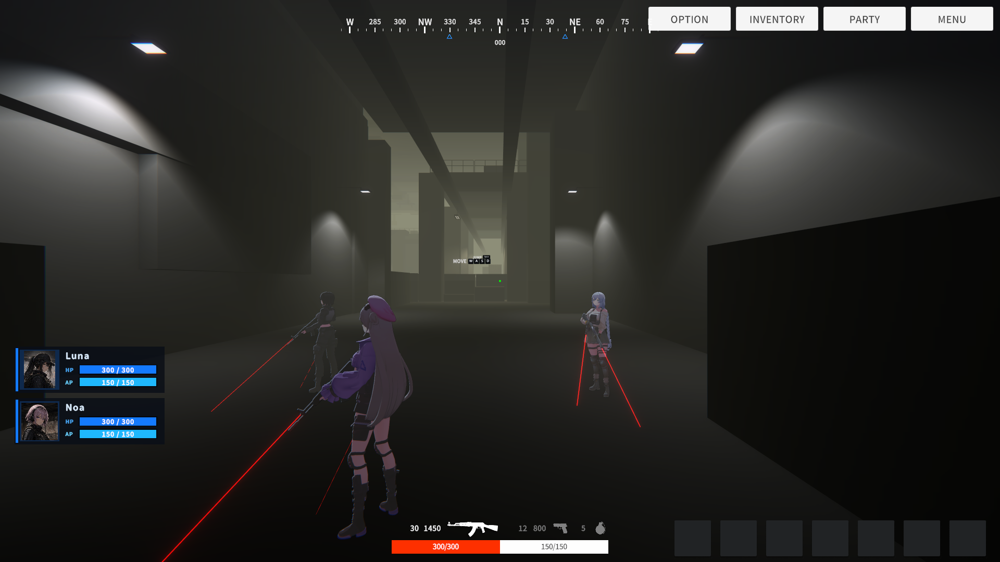

# Project BFX

> 게시 전 편집할 본문 초안입니다. 기간·팀 규모·역할 명칭은 사용자 확인 후 추가합니다.

## 프로젝트 소개

Unity 기반 프로젝트에서 퀘스트·대화·보상·저장을 연결하는 진행 시스템과 게임 UI를 작업했습니다. 코드 작성에는 AI의 도움을 받았으며, 저는 요구사항을 구체화하고 제안된 구조를 실제 플레이 시나리오에 대입해 검토했습니다. 특히 시스템 간 책임 경계, 콘텐츠 수정 단위, 반복 검증 방법을 중심으로 설계 방향을 조정했습니다.

## 구현한 기능

- 퀘스트의 수락·진행·완료·보상·저장과 외부 Dialogue System 연동
- 스프레드시트 대화 데이터의 검증·임포트와 NPC 대화 UI
- 메시지 피드·배너·무전·모달 및 런타임 검증 도구
- 캠페인 카메라·지도와 전투 HUD, 시간·환경 변화 기능

구현 소개는 이 정도로 짧게 두고, 아래 대화 GIF와 HUD 이미지로 결과를 보여줍니다. 목록은 이전 작업 정리를 기반으로 하며, 상세 기술 표기는 게시 전에 필요 범위에서 재확인합니다.

## 1. 기획의 구분이 반드시 실행 구조가 되어야 할까?

처음에는 스토리를 Sequence와 Beat로 나누고, 별도 관리자와 실행기가 진행 상태를 연결하는 구조를 검토했습니다. 그러나 퀘스트와 연출이 섞인 실제 시나리오를 대입하자 Quest와 Sequence가 진행을 중복해서 표현하고, 관계가 모호해졌습니다.

저는 기획상의 분류 단위를 그대로 코드의 제어 계층으로 만들 필요가 있는지 다시 질문했습니다. 필요한 순간에 무전이나 연출을 호출할 수 있다면, 현재 시나리오는 Quest·Dialogue·Trigger의 책임으로 구성하는 편이 자연스럽다고 판단했습니다. 예를 들어 특정 지역에 도달하면 무전을 재생하는 흐름은 해당 지역의 트리거로 표현하는 방향을 제안했습니다.

이 과정에서 추상화의 수보다 **현재 시나리오를 설명하는 데 필요한 책임과 연결의 수**를 기준으로 구조를 검토했습니다. 다만 재접속 이후의 연출 재생 여부까지 보장해야 한다면 별도 상태 관리가 필요할 수 있다는 제약을 함께 고려했습니다.

근거: [구조 재검토 질문](evidence/01-story-structure.png)

## 2. 콘텐츠를 수정하는 사람의 작업 단위에 맞추기

대화를 노드에서 하나씩 작성하는 방식의 반복 작업을 줄이기 위해 스프레드시트 기반 데이터화를 제안했습니다. 이후에는 임포트 기능만 만드는 데 그치지 않고 파일을 어떻게 나눠야 수정 대상을 찾기 쉬운지 검토했습니다.

Sequence 기준으로 묶인 데이터는 특정 NPC의 대화를 찾아 수정하는 작업과 잘 맞지 않았습니다. 이에 Conversation을 기준으로 워크북을 분리하고, 대사와 연결 정보를 Entries·Links 시트로 나누는 방향을 제안했습니다.

이 선택의 목적은 **실제 콘텐츠 수정 단위와 파일 단위를 맞춰 변경 범위를 명확히 하는 것**이었습니다. 서로 다른 대화를 나누어 작업하기 쉬운 구성이지만, 작업 시간이나 충돌 감소를 측정한 결과로 주장하지는 않습니다.

근거: [제작 방식 검토](evidence/10-dialogue-authoring.png), [워크북 분리 질문](evidence/02-content-workbook.png)

## 3. 연결된 시스템의 상태와 초기화 책임 구분하기

자체 퀘스트 시스템과 외부 대화 시스템을 연결할 때, 퀘스트 상태는 Quest 쪽에서 결정하고 Dialogue는 이를 참조해 대사와 선택지를 고르도록 방향을 잡았습니다. 대화 UI도 DialogueManager가 열기·닫기와 ESC를 관리하고, 프로젝트 UI와의 연결부는 활성화와 기존 UI 정책을 담당하도록 구분했습니다.

NPC 월드 UI에서는 데이터가 준비되는 시점과 UI가 이를 읽는 시점의 차이가 문제가 됐습니다. 별도 초기화 진입점을 만드는 제안에는 동의했지만, 이를 QuestManager에 종속시키는 방식에는 반대했습니다. 전체 초기화 순서를 아는 곳에서 데이터 준비 후 UI 초기화를 호출하도록 제안했습니다.

이때 고려한 기준은 **데이터를 참조한다는 이유만으로 그 데이터의 관리자가 UI 초기화까지 책임져야 하는 것은 아니라는 점**이었습니다. 순서에 대한 의존성은 명시하면서 도메인 간 책임이 불필요하게 확대되지 않도록 했습니다.

근거: [상태 소유권](evidence/03-quest-ownership.png), [대화 UI 제어](evidence/06-dialogue-lifecycle.png), [초기화 책임](evidence/04-initialization.png)

## 추가 사례: 제안을 그대로 수용하지 않고 필요를 다시 확인하기

DialogueManager 접근을 감싸는 래퍼를 검토하던 중, 호출할 메서드가 늘어날 때마다 전달 메서드를 추가해야 하는 유지보수 부담을 발견했습니다. 원래 목적은 씬에 매니저가 없을 때 존재를 보장하는 것이었으므로, 별도 계층을 늘리기보다 개발 시점에 씬에 명시적으로 배치하는 방향으로 수정했습니다.

알림 시스템에서는 Radio가 공통 NotificationService에 포함되지 않은 이유를 질문하고, 호출 창구를 통합하는 방향을 선택했습니다. 또한 게임 상황을 매번 재현하지 않고도 확인할 수 있도록 텍스트 입력과 전송이 가능한 무전 도구, 알림 종류를 모은 디버그 패널을 요청했습니다. 연속 호출 중 두 번째 메시지가 건너뛰는 현상을 직접 관찰해 문제를 제기한 기록도 남겼습니다.

근거: [래퍼 방향 수정](evidence/05-wrapper-reconsideration.png), [공통 API](evidence/07-notification-api.png), [검증 도구](evidence/08-runtime-testing.png), [큐 실패 관찰](evidence/09-queue-failure.png)

---

질문 이미지는 실제 앱 화면 캡처가 아닌 대화 원문 재구성입니다. 원문과 출처는 [근거 목록](evidence/README.md)에서 확인할 수 있습니다.
